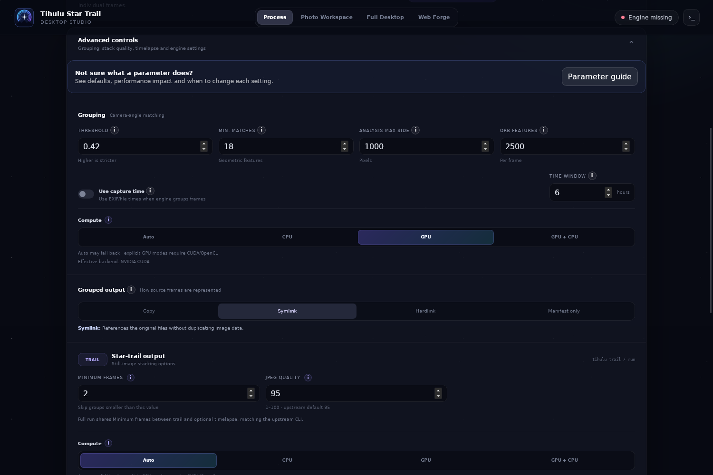
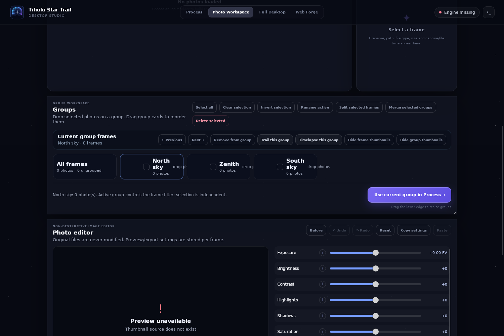
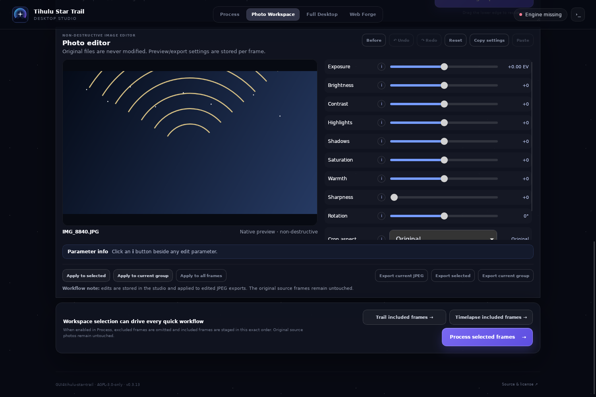
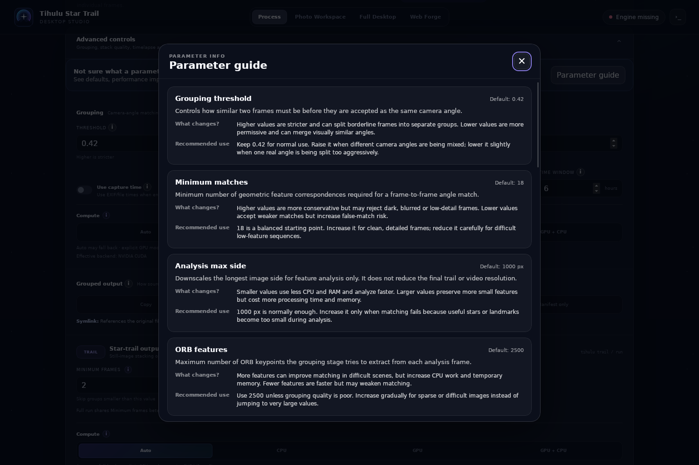

<p align="center">
  
</p>

<h1 align="center">Tihulu Star Trail Studio</h1>

<p align="center">
  Modern cross-platform desktop studio for <a href="https://github.com/Tihulu/tihulu-star-trail">tihulu-star-trail</a>.<br/>
  Built with Tauri 2 + TypeScript/Vite · local-first astrophotography workflow.
</p>

The GUI uses the installed `tihulu` engine as the source of truth instead of duplicating the astrophotography pipeline. Processing stays local and original source photos are not modified.

> The screenshots below are real v0.3.13 packaged-AppImage captures. They are placed next to the workflow they explain so the README can be used as a visual quick-start instead of a separate gallery.

## Process — Group, Trail, Timelapse and Full Run

Choose an input folder, one canonical project output directory, then run **Group**, **Trail**, **Timelapse**, or the complete **Full run** workflow. Readiness messages explain why a job cannot start instead of leaving the primary action silently disabled.



The Process workspace includes:

- native input/output pickers
- one canonical output directory shared with Photo Workspace
- independent Group / Trail / Timelapse settings
- custom Trail and Timelapse filenames inside the project output directory
- advanced grouping and rendering parameters
- streaming engine output and cancellation
- independent **Auto / CPU / GPU / GPU+CPU** hardware selectors
- an **Effective backend** readout based on the engine's actual runtime report

### GPU behavior

Hardware selection is passed directly in each job request. Explicit GPU jobs carry the exact engine flags, including `--group-hardware gpu`, `--trail-hardware gpu`, and `--timelapse-hardware gpu`; they are not silently rewritten to Auto or CPU.

Grouping is intentionally a hybrid pipeline on the standard packaged OpenCV stack: CUDA/CuPy accelerates descriptor matching, while image decode, ORB feature extraction, and RANSAC homography can still use the CPU. Seeing some CPU activity during GPU grouping is therefore expected. If an explicit GPU backend is unavailable, the job should stop with a diagnostic instead of pretending GPU acceleration succeeded.

## Photo Workspace — visual review, groups and frame inclusion

After **Group** or **Full run**, engine groups are mapped back to the original source photos and imported into the workspace atomically. The group strip is not rebuilt visibly one group at a time, which avoids the scrollbar/layout jumping that is especially distracting on large projects.



Manual review supports:

- Ctrl/Cmd multi-select and Shift range-select
- Select all / Clear selection / Invert selection
- drag selected frames as a block
- move selected frames between groups
- create, rename, reorder, split, merge and delete groups
- mass-delete group records without deleting source photos
- group Undo / Redo
- Previous / Next frame navigation
- filename/date sorting followed by manual ordering
- frame and group thumbnail visibility controls
- manual **Sync engine groups** when an explicit refresh is useful

### Active group and `Include all`

Clicking **All frames** or a group makes that scope the active Frames view. Opening a scope includes all frames in that scope by default.

`Include all` belongs to the **currently visible Frames scope**, not the whole project:

- checked → every visible frame is included
- mixed/indeterminate → only some visible frames are included
- unchecked → the visible scope is excluded
- switching to another group gives that group's own visible inclusion state
- clicking **All frames** returns to the project-wide frame view

The active group used for viewing remains separate from multi-selected groups used for group operations.

### Large projects and thumbnails

The workspace avoids using full-resolution source images as list thumbnails. Native thumbnail generation/cache is reused by frame cards and group mini-previews, while viewport-aware loading limits unnecessary decode work. Off-screen previews are released and parallel decode work is bounded so hundreds or thousands of frames do not intentionally block the UI thread.

## Non-destructive Photo Editor

The editor uses the same native decoded preview path as the workspace instead of asking the WebView to decode the original full-resolution local file again. This keeps JPEG/RAW preview behavior consistent with the thumbnail pipeline.



Per-frame edit state includes exposure, brightness, contrast, highlights, shadows, saturation, warmth, sharpness, rotation, crop aspect and JPEG export quality. The editor provides **Before**, **Undo**, **Redo**, **Reset**, Copy/Paste settings, and scoped application to selected frames, the current group or all frames.

Edited JPEG export is available for the current frame, selection or current group. Originals remain untouched.

## Parameter Guide

Inline `i` help and the Parameter Guide explain grouping strictness, capture-time constraints, output controls, hardware policies, thumbnail behavior and editor parameters without requiring users to know the CLI flags first.



## Processing workspaces

The application has four top-level workspaces:

1. **Process** — Full run / Group / Trail / Timelapse, native pickers, readiness reasons, hardware policies, advanced CLI parameters, streaming logs and cancellation.
2. **Photo Workspace** — visual frame review, inclusion, ordering, engine-group sync, group editing, cached previews and non-destructive image edits.
3. **Full Desktop** — launches the installed upstream `tihulu desktop`, preserving the original native feature set.
4. **Web Forge** — launches the engine-backed local `tihulu ui` workflow.

## Engine compatibility and one-line install

Linux x86_64 / macOS:

```sh
curl -fsSL https://raw.githubusercontent.com/Tihulu/GUI4tihulu-star-trail/main/scripts/install.sh | sh
```

Windows PowerShell:

```powershell
irm https://raw.githubusercontent.com/Tihulu/GUI4tihulu-star-trail/main/scripts/install.ps1 | iex
```

The installers verify the engine capabilities needed by the current GUI, including Group / Trail / Timelapse hardware policies. Linux AppImage launches the external managed Python engine through a sanitized environment so AppImage-specific Python/library paths do not leak into the engine runtime.

## Platforms

Release builds target:

- Windows x86_64 (NSIS)
- macOS Universal (Intel + Apple Silicon)
- Linux x86_64 (AppImage)

Linux ARM64 GUI publishing is intentionally deferred until the upstream engine has formal ARM64 CI/release coverage; it is **not** a released target today.

## Release validation

Before release, the project requires TypeScript/Rust regression coverage plus Linux, Windows and macOS package builds. Linux additionally runs the **real packaged AppImage** under the acceptance harness.

The packaged acceptance path covers native thumbnail IPC, Photo Editor canvas rendering, atomic multi-group workspace import, visible-group inclusion behavior, exact GPU job flags and Effective backend reporting. A versioned release is not considered ready while that acceptance path is red.

## License

`AGPL-3.0-only`. See `LICENSE`.
